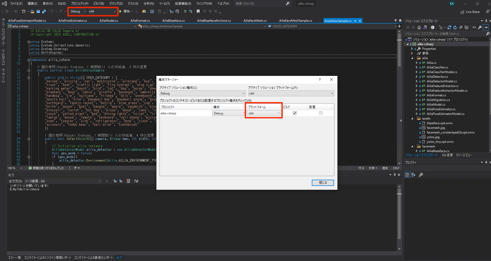
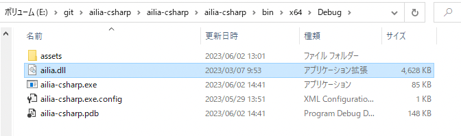
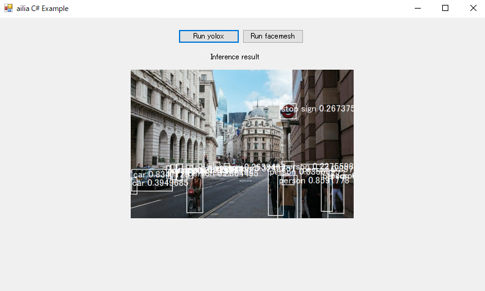
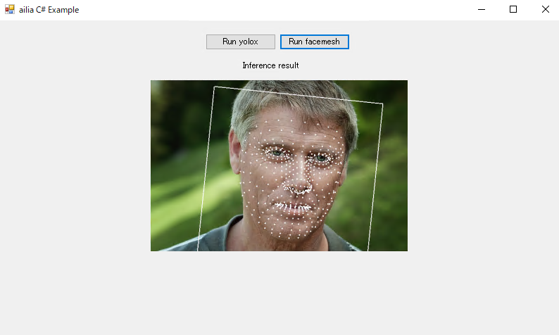

# ailia-csharp

This is a sample to execute ailia's Inference API using C#.

## Requirements

- Windows 10
- VisualStudio 2019

## Architecture

Unity's cs file can be used from Visual Studio just by commenting out import UnityEngine.
Debug.Log, Color32, Vactor2, Mathf are not defined, so define them in [AiriaMigration.cs](/ailia-csharp/ailia-csharp/ailia/AiliaMigration.cs).

## Build

- Open `ailia-csharp.sln`.
- Change active platform `Any CPU` to `x64`.

- Build.

## Run

- Manually place `ailia.dll` to `/ailia-csharp/ailia-csharp/bin/x64/Debug`.
- If you are using the evaluation version, place the license file in the same folder as the dll.

- `*.onnx` and `*.jpg` are automatically place to `/ailia-csharp/ailia-csharp/bin/x64/Debug` on build process.
- Run.

## Result

### yolox

Read yolox.jpg and display the inference result of yolox.

### facemesh

Read facemesh.jpg and display the inference result of facemesh.

## Architecture

The inference code is below. Usage is the same as the Unity version.

- [Form1.cs](/ailia-csharp/ailia-csharp/Form1.cs)
- [AiliaYoloxSample.cs](/ailia-csharp/ailia-csharp/yolox/AiliaYoloxSample.cs)
- [AiliaFaceMeshSample.cs](/ailia-csharp/ailia-csharp/facemesh/AiliaFaceMeshSample.cs)

# Test images

- https://pixabay.com/ja/photos/%E3%82%B7%E3%83%86%E3%82%A3%E3%82%AA%E3%83%96%E3%83%AD%E3%83%B3%E3%83%89%E3%83%B3-%E9%8A%80%E8%A1%8C-4481399/
- https://pixabay.com/ja/photos/%E4%BA%BA-%E4%BA%BA%E9%96%93-%E7%94%B7%E6%80%A7%E7%9A%84-%E9%A1%94-%E7%94%B7-829966/